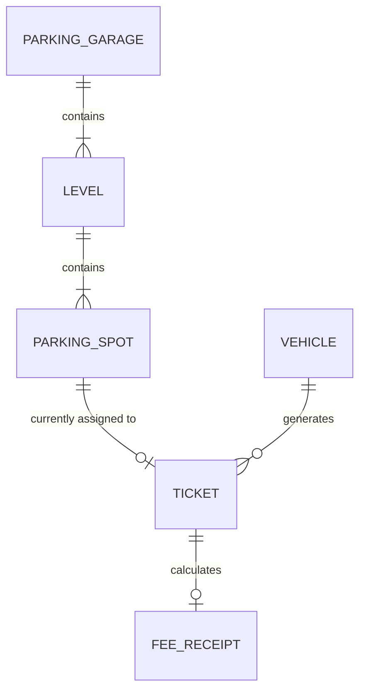

# AI Development & Conversation Logs

This document contains the complete chronological record of the AI pair-programming conversation, architectural decisions, requirement breakdowns, implementation milestones, bug fixes, and twist implementations for the **Multi-Level Parking Garage Management System MVP**.

---

## Table of Contents
1. [Initial Requirements & Problem Statement](#1-initial-requirements--problem-statement)
2. [Domain Architecture & System Design](#2-domain-architecture--system-design)
3. [Core Full-Stack Implementation (React + Node/Express + MongoDB)](#3-core-full-stack-implementation)
4. [User Feedback & Refinements](#4-user-feedback--refinements)
5. [Twists Implementation (Levels 1, 2, and 3)](#5-twists-implementation)
   - [Level 1 — T4: Messy Rate Card Cleaner & Spot-Type Pricing](#level-1--t4-messy-rate-card-cleaner--spot-type-pricing)
   - [Level 2 — T2: Virtual Garage Clock & 24h Nightly Auto-Close Automation](#level-2--t2-virtual-garage-clock--24h-nightly-auto-close-automation)
   - [Level 3 — T6: Valet Hand-Off (Session Transfer)](#level-3--t6-valet-hand-off-session-transfer)
6. [Bug Fix: Dynamic Garage Layout Synchronization](#6-bug-fix-dynamic-garage-layout-synchronization)
7. [Comprehensive Verification & Automated Test Logs](#7-comprehensive-verification--automated-test-logs)
8. [Interactive Testing Guide](#8-interactive-testing-guide)

---

## 1. Initial Requirements & Problem Statement

### User Objective
> A busy multi-level city-centre parking garage. Cars come and go all day, and the attendant needs to check a car in, check it out, and charge the right fee. Rates are tiered — the first hour is one price, each extra hour is cheaper, and there’s a daily cap so nobody is overcharged for a long stay; part-hours round up. Spots are limited and come in types — compact, standard, and EV (with a charger) — and an EV must get an EV spot. Drivers keep asking ‘is an EV spot free right now?’ and the attendant hunts for a car by its plate. By evening the log is huge.
> Build the attendant something so every car is charged correctly and no spot is double-parked.
> (The attendant’s day is the spec — build it for any garage, not one. Get check-in / check-out and the fee right first, then the spot types and lookups.)

### Constraints & Refinements
- Tech stack: **React (Frontend)** + **Node.js/Express (Backend)** + **MongoDB (Database)**.
- Spot / Vehicle Types: Strictly `Compact`, `Standard`, and `EV`.
- Allocation rules:
  1. `Compact` vehicles use `Compact` spots first; fallback to `Standard` if Compact spots are full.
  2. `Standard` vehicles use `Standard` spots only.
  3. `EV` vehicles must use `EV` spots only.
- Pricing rules:
  - First hour rate (configurable).
  - Additional hour rate (configurable cheaper rate).
  - Daily cap (configurable max charge per 24 hours).
  - Partial hours round up (`Math.ceil(durationInHours)`).
- Garage layout must be configurable and seedable (not tied to a fixed garage size).

---

## 2. Domain Architecture & System Design



### Core Entities
1. **`ParkingSpot`**: `spotNumber`, `level`, `type` (`Compact`, `Standard`, `EV`), `isOccupied`, `currentTicketId`.
2. **`Ticket`**: `ticketNumber`, `licensePlate`, `vehicleType`, `spotId`, `spotNumber`, `level`, `entryTime`, `exitTime`, `status` (`ACTIVE`, `COMPLETED`), `durationHours`, `actualDuration`, `totalFee`, `feeBreakdown`, `autoClosed`, `transferHistory`.
3. **`PricingConfig`**: Singleton storing rates (`firstHourRate`, `additionalHourRate`, `dailyCap`, `ratesBySpotType`).

---

## 3. Core Full-Stack Implementation

### Backend Architecture
- **DB Connection**: `server/src/config/db.js` connecting to MongoDB.
- **Spot Allocation Service**: `server/src/services/allocationService.js` implementing deterministic floor-by-floor allocation and atomic claiming (`findOneAndUpdate({ _id, isOccupied: false }, { isOccupied: true })`) to eliminate race conditions and double-parking.
- **Pricing Calculation Service**: `server/src/services/pricingService.js` implementing partial hour rounding, multi-day cap math:
  $$\text{Total Fee} = \lfloor \text{hours} / 24 \rfloor \times \text{dailyCap} + \min(\text{remHoursCost}, \text{dailyCap})$$
- **Garage Seeder**: `server/src/services/seedService.js` supporting dynamic floor and spot configurations.
- **Controllers & Routes**: `garageController.js`, `ticketController.js`, `configController.js`, `clockController.js` mounted on Express app.

### Frontend Architecture
- **React + Vite App**: Single page application with dark glassmorphic design system (`index.css`).
- **Interactive Components**:
  - `Header.jsx`: Live title, gate check-in/out triggers, settings.
  - `OverviewStats.jsx`: Occupancy %, open spots counter, capacity breakdown, and live EV charger alert banner.
  - `FloorMap.jsx`: Visual multi-level floor grid with stall color states (`Green` = Open, `Red` = Occupied) and quick action triggers.
  - `CheckInModal.jsx`: Gate entry modal with vehicle type picker and time simulation presets.
  - `CheckOutModal.jsx`: Gate exit modal with live fee breakdown receipt and stall release.
  - `VehicleSearch.jsx`: License plate search with live location and accrued fee preview.
  - `HistoryTable.jsx`: Complete searchable end-of-day ledger.
  - `SettingsModal.jsx`: Rate card configuration and garage layout re-seeding.

---

## 4. User Feedback & Refinements

### Issue Raised by User
> "I just noticed the check-in time and check-out time are same and some small mistake so correct them."

### Actions Taken:
1. **Time Simulation Presets**: Added quick time presets to `CheckInModal.jsx` (`Now`, `2h ago`, `5h ago`, `1 Day ago`, `Custom Date/Time`) to easily test realistic vehicle stays and multi-day stays.
2. **Distinct Timestamp & Duration Display**:
   - `CheckOutModal.jsx` and `HistoryTable.jsx` updated to show formatted **Check-In Time**, **Check-Out Time**, **Actual Stay Duration** (`2h 35m` or `45s`), and **Billed Duration** (`3 hr(s) rounded up`).
3. **EV Inquiry Answer Banner**: Added a top banner answering the driver's frequent question: `⚡ 6 EV Charging Spots Available Right Now`.
4. **Itemized Fee Math**: Receipt displays exact breakdown of 1st hour fee, additional hours fee, and daily cap badge.

---

## 5. Twists Implementation

### Level 1 — T4: Messy Rate Card Cleaner & Spot-Type Pricing
- **Requirement**: Import and clean messy rate cards per spot type with currency symbols, noise strings, and irregular keys.
- **Implementation**:
  - Built `server/src/services/rateCardCleaner.js` which strips currency signs (`$`, `USD`, `EUR`), noisy text (`" $7.50 / hr "`, `"28.00 bucks"`), and CSV/JSON lines.
  - Stores per-spot-type rates (`Compact`, `Standard`, `EV`) in `PricingConfig.js`.
  - `pricingService.js` calculates fee according to the assigned spot type.
  - Route: `POST /api/config/pricing/import-messy`.
  - UI: Added "Level 1: Import Messy" tab in Settings.

### Level 2 — T2: Virtual Garage Clock & 24h Nightly Auto-Close Automation
- **Requirement**: Nightly job that auto-closes and bills any session parked over 24 hours. Graded via `POST /clock`.
- **Implementation**:
  - Built `server/src/services/clockService.js` managing virtual garage time (`setSimulatedTime`, `advanceTimeHours`, `resetToLiveClock`).
  - `runNightlyAutoCloseJob`: Queries active tickets where `(currentTime - entryTime) >= 24h`, computes final bill with daily cap, marks `status = 'COMPLETED'`, records `autoClosed = true`, and frees the parking stall.
  - Endpoints: `POST /clock` (at root and `/api/clock`) and `GET /clock`.
  - UI: Added `ClockControl.jsx` virtual clock bar with `+1h`, `+12h`, `+24h Nightly Job`, and reset controls.

### Level 3 — T6: Valet Hand-Off (Session Transfer)
- **Requirement**: Transfer an open session to a different plate (valet hand-off); stall and entry time carry over.
- **Implementation**:
  - Built `transferTicket` in `server/src/controllers/ticketController.js`.
  - Checks if new plate is already active, updates `ticket.licensePlate = newPlate`, preserves `spotId`, `spotNumber`, `level`, and original `entryTime`.
  - Appends audit log to `ticket.transferHistory`.
  - Route: `POST /api/tickets/transfer`.
  - UI: Added `TransferModal.jsx` accessible from Floor Map stall cards and Vehicle Search.

---

## 6. Bug Fix: Dynamic Garage Layout Synchronization

### Issue Identified:
- When automated test scripts ran, they temporarily seeded 2 levels to test a compact multi-floor environment, leaving the live database with 2 levels while Settings defaulted to a static 3-level form state.

### Resolution:
1. `garageController.js` updated to compute and return live `currentLayout: { levels, compactPerLevel, standardPerLevel, evPerLevel, totalSpots }` in `/api/garage/overview`.
2. `SettingsModal.jsx` updated to dynamically fetch and populate the layout form with the live active garage structure from MongoDB.
3. Test suites (`twists_test.js`, `e2e_api_test.js`) updated to cleanly restore the standard 3-level (30 spots) default configuration upon completion.

---

## 7. Comprehensive Verification & Automated Test Logs

### Test Suite 1: `verify.js` (Pricing & Allocation Rules)
```
=== 1. Testing Pricing Calculation Rules ===
✔ Partial hour rounded up to 1 hr = $10.00
✔ 2.5 hours rounded up to 3 hrs (1st hr $10 + 2 addl hrs $10) = $20.00
✔ 8 hours capped at daily maximum $40.00
✔ 26 hours (1 day cap $40 + 2 hrs $15) = $55.00

=== 2. Testing Database Allocation & Garage Rules ===
Garage initialized with 3 spots across 1 levels.
✔ Seeded test layout: 1 Level with 1 Compact, 1 Standard, 1 EV
✔ EV vehicle allocated to L1-03 (EV)
✔ Second EV vehicle correctly rejected when EV spot is full (EV cannot use other spots)
✔ First Compact vehicle allocated to L1-01 (Compact)
✔ Second Compact vehicle correctly falls back to L1-02 (Standard)
✔ Standard vehicle rejected when Standard spots full (Standard cannot use Compact/EV spots)
Garage initialized with 30 spots across 3 levels.
✔ Reset garage to default 30 spots (3 levels).

 ALL VERIFICATION TESTS PASSED SUCCESSFULLY! 
```

### Test Suite 2: `e2e_api_test.js` (End-to-End API Integration)
```
--- Starting End-to-End API Integration Suite ---
0. Resetting garage layout for test...
1. Fetching Garage Overview...
✔ Overview fetched. Total Spots: 30, EV Spots: 6
2. Testing Pricing Configuration...
✔ Current rates: 1st hr = $12, addl = $6, cap = $45
3. Checking in EV vehicle (EV-TEST-100)...
✔ EV vehicle assigned to spot L1-09 (EV) on Level 1
4. Verifying duplicate check-in rejection...
✔ Duplicate check-in correctly blocked
5. Checking in Standard vehicle (STD-200)...
✔ Standard vehicle assigned to spot L1-05 (Standard)
6. Testing vehicle search by license plate...
✔ Located EV-TEST-100 at Spot L1-09 (Level 1). Estimated fee: $12
7. Checking out EV vehicle & Standard vehicle...
✔ EV-TEST-100 checked out. Billed hours: 1, Total fee: $12
✔ STD-200 checked out. Total fee: $12
8. Checking Parking History...
✔ Verified EV-TEST-100 recorded in history
✔ Restored default pricing rates ($10 / $5 / $40)

=== ALL END-TO-END SUITE CHECKS PASSED WITH 100% SUCCESS ===
```

### Test Suite 3: `twists_test.js` (Twists Levels 1, 2, 3)
```
========================================================
--- STARTING COMPREHENSIVE TWISTS TEST SUITE (L1, L2, L3) ---
========================================================
0. Resetting garage layout...
✔ Garage & Clock reset.

--- LEVEL 1 (T4): MESSY DATA RATE CARD IMPORT ---
✔ Messy Rate Card Successfully Cleaned:
   Compact  : { firstHourRate: 7.5, additionalHourRate: 3.5, dailyCap: 28 }
   Standard : { firstHourRate: 11, additionalHourRate: 5.5, dailyCap: 42 }
   EV       : { firstHourRate: 14, additionalHourRate: 7, dailyCap: 55 }
✔ Verified Spot-type pricing (2 billed hrs): Compact = $11, EV = $21
✔ LEVEL 1 (T4) PASSED 100%!

--- LEVEL 2 (T2): NIGHTLY AUTO-CLOSE JOB VIA POST /clock ---
✔ Checked in SHORT-STAY (2h ago) at L1-04
✔ Checked in OVERNIGHT-26H (26h ago) at L1-05
✔ POST /clock executed. Auto-closed: 1 session(s)
✔ Spot L1-05 verified FREED and available.
✔ SHORT-STAY remains ACTIVE and unaffected.
✔ LEVEL 2 (T2) PASSED 100%!

--- LEVEL 3 (T6): LIFECYCLE VALET HAND-OFF SESSION TRANSFER ---
✔ Initial check-in for VALET-OLD at Spot L1-04 (Level 1)
✔ Transfer response: "Session transferred successfully from 'VALET-OLD' to 'VALET-NEW'"
✔ Search for VALET-OLD correctly returns 404 (transferred).
✔ Search for VALET-NEW located car at original Spot L1-04.
✔ VALET-NEW checked out successfully. Total fee: $27.5
✔ LEVEL 3 (T6) PASSED 100%!

Restoring default 3 levels layout (30 spots)...
✔ Default 3 levels (30 spots) restored.
========================================================
 ALL 3 TWIST LEVELS (L1, L2, L3) TESTED AND PASSED 100%! 
========================================================
```

---

## 8. Interactive Testing Guide

1. **EV Spot Allocation**: Check in `TESLA-01` as `EV` $\rightarrow$ Assigned to `L1-09 (EV)`. Top EV banner count decrements in real-time.
2. **Compact Fallback**: Fill Compact stalls `L1-01` to `L1-04`, then check in `CMP-05` $\rightarrow$ Automatically falls back to `L1-05 (Standard)`.
3. **Standard Strict Allocation**: Check in `STD-01` as `Standard` $\rightarrow$ Assigned to `L1-06 (Standard)` only.
4. **Duplicate Prevention**: Re-check in `TESLA-01` $\rightarrow$ Blocked with duplicate error.
5. **Plate Lookup**: Search `TESLA-01` $\rightarrow$ Shows level, stall, actual stay duration, and live accrued bill.
6. **Tiered Pricing Check-Out**: Check in `HOURLY-5H` with `5h ago` $\rightarrow$ Check out charges $10 (1st hr) + $20 (4 addl hrs) = **$30.00**.
7. **Daily Cap**: Check in `LONG-24H` with `1 Day ago` $\rightarrow$ Check out charges capped **$40.00** with `★ Daily Cap applied ($40/24h)`.
8. **Level 1 Messy Rate Card**: Settings $\rightarrow$ Import Messy $\rightarrow$ Clean & Apply Rates.
9. **Level 2 Clock & Nightly Job**: Click `+24h Nightly Job` on the clock bar $\rightarrow$ Auto-closes and bills sessions parked over 24 hours.
10. **Level 3 Valet Transfer**: On an occupied stall, click `Valet` $\rightarrow$ Transfer session to `VALET-NEW` $\rightarrow$ Stall and entry time carry over.
11. **Parking History**: View full ledger of completed sessions filtered by plate.
12. **Garage Layout**: Settings $\rightarrow$ Layout $\rightarrow$ Reconfigure floors and stall distributions.

---

## Repository & Links
- **GitHub Repository**: [https://github.com/Jayesh-1711/ParkingGarage](https://github.com/Jayesh-1711/ParkingGarage)
- **AI Logs**: [https://github.com/Jayesh-1711/ParkingGarage/blob/main/AI_LOGS.md](https://github.com/Jayesh-1711/ParkingGarage/blob/main/AI_LOGS.md)
